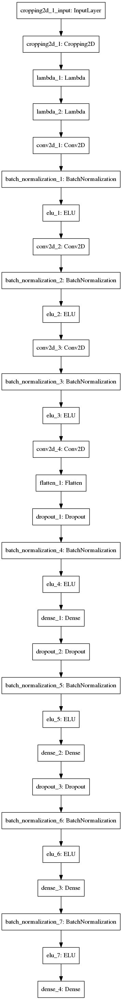
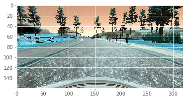
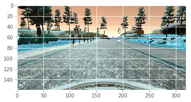
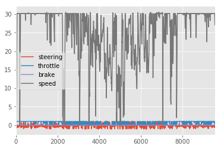
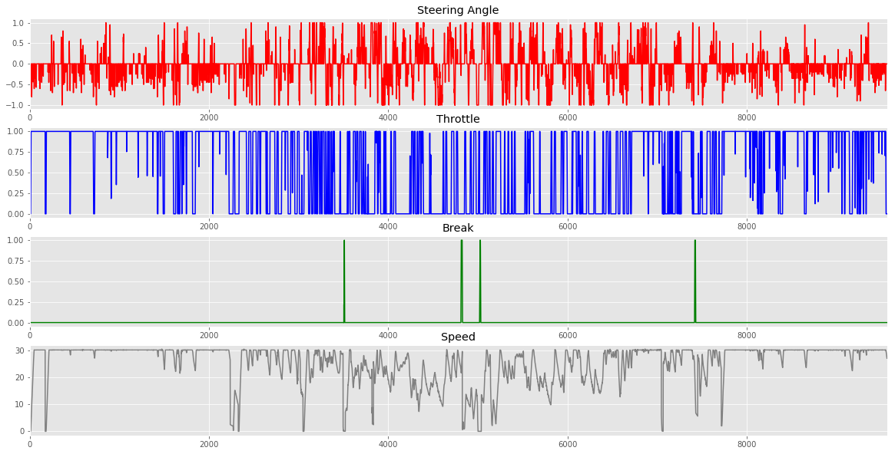

**Behavioral Cloning Project**

The goals / steps of this project are the following:
* Use the simulator to collect data of good driving behavior
* Build, a convolution neural network in Keras that predicts steering angles from images
* Train and validate the model with a training and validation set
* Test that the model successfully drives around track one without leaving the road
* Summarize the results with a written report


[//]: # (Image References)

[image1]: ./examples/placeholder.png "Model Visualization"
[image2]: ./examples/placeholder.png "Grayscaling"
[image3]: ./examples/placeholder_small.png "Recovery Image"
[image4]: ./examples/placeholder_small.png "Recovery Image"
[image5]: ./examples/placeholder_small.png "Recovery Image"
[image6]: ./examples/placeholder_small.png "Normal Image"
[image7]: ./examples/placeholder_small.png "Flipped Image"


---
### Files Submitted & Code Quality

1. Submission includes all required files and can be used to run the simulator in autonomous mode

My project includes the following files:
* model.py containing the script to create and train the model
* drive.py for driving the car in autonomous mode
* model.h5 containing a trained convolution neural network
* writeup_report.md or writeup_report.pdf summarizing the results

---
### Submission includes functional code
Using the Udacity provided simulator and my drive.py file, the car can be driven autonomously around the track by executing
```sh
python drive.py model.h5
```

---

### Submission code is usable and readable

The model.py file contains the code for training and saving the convolution neural network. The file shows the pipeline I used for training and validating the model, and it contains comments to explain how the code works.

### Model Architecture and Training Strategy

1. An appropriate model architecture has been employed
   I started with Nvidia model

2. Attempts to reduce overfitting in the model

The model contains dropout layers in order to reduce overfitting (model.py lines 94 ,99 and 104).
The model was trained and validated on different data sets to ensure that the model was not overfitting (code line 137).
The model was tested by running it through the simulator and ensuring that the vehicle could stay on the track.

 ### Model parameter tuning

The model used an adam optimizer, so the learning rate was not tuned manually (model.py line 115).

### Appropriate training data

Training data was chosen to keep the vehicle driving on the road. I used a combination of center lane driving, recovering from the left and right sides of the road ...

For details about how I created the training data, see the next section.

### Model Architecture and Training Strategy

#### 1. Solution Design Approach

I initially started with the simple model as described  in the  training  video using only the Dense layers  and the udacity provided  training data. Created the model and tested on the simulator the Vehicle started to move smoothly  but went over the track as soon as there was a turn.
Then I started from the Nvidia model described  in the videos and also from the internet implemented the model and trained on the this model using only the center images from udacity network and performance was better but the vehicle did  went out of track.  Then I tried using both left and right images applying correction of 0.2 to the steering  as described in the slack community. This model did perform little better but the car still went off the track.

I trained the model on the training data I  collected(which is described in Section 3 below)  , it was better but still went out of the track.  
I looked at comma.ai network and the github link  : https://review.udacity.com/#!/rubrics/432/view . I changed the RELU to ELU so the learning is faster in deep neural networks and better classifcation accuracy [https://arxiv.org/abs/1511.07289].
I  added batch normalization  after every convolution network [https://arxiv.org/abs/1502.03167]. Batch Normalization allows us to use higher learning  rates and be less careful about initialization also its acts as regularizer.
All  in all the networks consists of 3 1x1 with stride 1 folllowed by 36 5x5 stride 4 , 48 5x5 stride 2 and 64 3x3 stride 2  and 4 fully connected networks.

Total params: 11,137,925.0
Trainable params: 11,114,179.0
Non-trainable params: 23,746.0  


At the end of the process, the vehicle is able to drive autonomously around the track1 without leaving the road.

#### 2. Final Model Architecture

The final model architecture (model.py lines 72-119) consisted of a convolution neural network with the following layers and layer sizes ...

| Layer (type)                 | Output Shape       | Param # |
|------------------------------|--------------------|---------|
| cropping2d_1 (Cropping2D)    | (None, 65, 320, 3) | 0       |
| lambda_1 (Lambda)            | (None, 60, 160, 3) | 0       |
| lambda_2 (Lambda)            | (None, 60, 160, 3) | 0       |
| conv2d_1 (Conv2D)            | (None, 60, 160, 3) | 12      |
| batch_normalization_1 (Batch | (None, 60, 160, 3) | 12      |
| elu_1 (ELU)                  | (None, 60, 160, 3) | 0       |
| conv2d_2 (Conv2D)            | (None, 15, 40, 36) | 2736    |
| batch_normalization_2 (Batch | (None, 15, 40, 36) | 144     |
| elu_2 (ELU)                  | (None, 15, 40, 36) | 0       |
| conv2d_3 (Conv2D)            | (None, 8, 20, 48)  | 43248   |
| batch_normalization_3 (Batch | (None, 8, 20, 48)  | 192     |
| elu_3 (ELU)                  | (None, 8, 20, 48)  | 0       |
| conv2d_4 (Conv2D)            | (None, 4, 10, 64)  | 27712   |
| flatten_1 (Flatten)          | (None, 2560)       | 0       |
| dropout_1 (Dropout)          | (None, 2560)       | 0       |
| batch_normalization_4 (Batch | (None, 2560)       | 10240   |
| elu_4 (ELU)                  | (None, 2560)       | 0       |
| dense_1 (Dense)              | (None, 1024)       | 2622464 |
| dropout_2 (Dropout)          | (None, 1024)       | 0       |
| batch_normalization_5 (Batch | (None, 1024)       | 4096    |
| elu_5 (ELU)                  | (None, 1024)       | 0       |
| dense_2 (Dense)              | (None, 512)        | 524800  |
| dropout_3 (Dropout)          | (None, 512)        | 0       |
| batch_normalization_6 (Batch | (None, 512)        | 2048    |
| elu_6 (ELU)                  | (None, 512)        | 0       |
| dense_3 (Dense)              | (None, 10)         | 5130    |
| batch_normalization_7 (Batch | (None, 10)         | 40      |
| elu_7 (ELU)                  | (None, 10)         | 0       |
| dense_4 (Dense)              | (None, 1)          | 11      |

Total params: 11,137,925.0
Trainable params: 11,114,179.0
Non-trainable params: 23,746.0

Here is a visualization of the architecture (note: visualizing the architecture is optional according to the project rubric)

#### Training Model Visualization



#### 3. Creation of the Training Set & Training Process

I collected my training data by doing 2 laps of proper driving on both the tracks and I also collected data by placing the vehicle close to the corners and turns and steering the vehicle back to position , I did this on both the tracks.

To augment the data set , I flipped images and angles.
Normal Center image  



Horizontally Flipped Image



I visualized the data and the distribution as follows

Data Visualization



Data Distribution



During that I saw there was huge concentration with steering value =0 ,So dropped 50% of the data points which had steering  =0. So it doesn't overfit.


After the collection process, I had 37979 number of images. I then preprocessed this data as following
1) Cropping
2) Resizing
3) Normalizing

I used only the center images for validation , used sklearn train_test_split to randomly split the training data in to validation and training data.
I also implemented early stopping to terminated if the validation loss didnt improve.
I used this training data for training the model. The validation set helped determine if the model was over or under fitting. The ideal number of epochs was around 8 . I used an adam optimizer so that manually training the learning rate wasn't necessary.

### Here is the Video of the model autonomously driving the car around track.

[](https://youtu.be/eI60rFv7xck)
