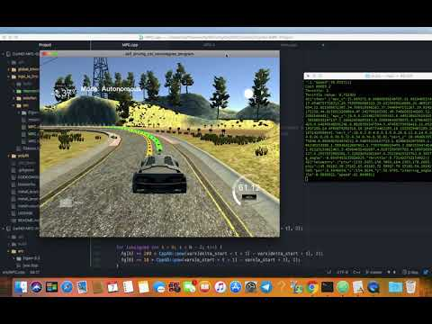

# CarND-Controls-MPC
Self-Driving Car Engineer Nanodegree Program

---
This is the final project of Term 2 , the goal of the project is to drive a car autonomously in a simulator using model predictive control. The program uses a simple global kinematic model.

Click the image below for the youtube video link

[](https://youtu.be/HCSxnR2M-a0)

## Model

The model implements a simple  kinematic model ignoring tires forces , gravity and mass. Dynamic model takes this in to consideration.
The state of the vehicle is defined by the position(_x_,_y_) , heading direction (_ψ_) and velocity (_v_).

State vector _(x,y,ψ,v)_

The are two actuators which helps to move the  car steering angle  (_δ_)  and throttle (_a_) . The steering angle of the car is between (-25, 25) degrees.  The acceleration of the car is  between (-1,1) a negative value will brake the car and positive will accelerate.

Actuators: _[δ,a]_.

The kinematic  model helps to predict the next state of vehicle using the current state of the vehicle and the time elasped.
Next state is defined as below .

   ````
   x_[t+1] = x[t] + v[t] * cos(psi[t]) * dt
   y_[t+1] = y[t] + v[t] * sin(psi[t]) * dt
   psi_[t+1] = psi[t] + v[t] / Lf * delta[t] * dt
   v_[t+1] = v[t] + a[t] * dt
   cte[t+1] = f(x[t]) - y[t] + v[t] * sin(epsi[t]) * dt
   epsi[t+1] = psi[t] - psides[t] + v[t] * delta[t] / Lf * dt

   ````

## Model Predictive Control

The main goal of this project is to tune the parameters for the cost function and model.
We start with transformation  of the waypoints in to vehicle coordinates, which is  accomplished by using affine transform .

````
//  Shift car reference angle to 90
for (int i=0;i<ptsx.size();i++){
  double shift_x = ptsx[i] - px;
  double shift_y = ptsy[i] - py;

  ptsx[i] = (shift_x * cos(-psi) - shift_y * sin(-psi));
  ptsy[i] = (shift_x * sin(-psi) + shift_y * cos(-psi));

}
````
Here we assume a latency of 100 milliseconds which is introduced to stimulate a human reaction time on the actuators.
Next We calculate the next state of the vehicle by using equations above.

I choose the time horizon  to be 1 seconds after experiments. As explained in the lessons we want the horizon in the future state we want to predict , We don't want to  predict too much into future as when we get there the variables would have changed , So 1 second was reasonable  for higher speeds may be will choose 2 seconds  because the vehicle will reach the future state faster.
N = 20 and dt = 0.05 was chosen with Horizon = N*dt = 1 second.

The cost function weights are chosen by trial and error experiments .Values where chosen to drive the vehicle safely at maximal speed.


## Dependencies

* cmake >= 3.5
 * All OSes: [click here for installation instructions](https://cmake.org/install/)
* make >= 4.1(mac, linux), 3.81(Windows)
  * Linux: make is installed by default on most Linux distros
  * Mac: [install Xcode command line tools to get make](https://developer.apple.com/xcode/features/)
  * Windows: [Click here for installation instructions](http://gnuwin32.sourceforge.net/packages/make.htm)
* gcc/g++ >= 5.4
  * Linux: gcc / g++ is installed by default on most Linux distros
  * Mac: same deal as make - [install Xcode command line tools]((https://developer.apple.com/xcode/features/)
  * Windows: recommend using [MinGW](http://www.mingw.org/)
* [uWebSockets](https://github.com/uWebSockets/uWebSockets)
  * Run either `install-mac.sh` or `install-ubuntu.sh`.
  * If you install from source, checkout to commit `e94b6e1`, i.e.
    ```
    git clone https://github.com/uWebSockets/uWebSockets
    cd uWebSockets
    git checkout e94b6e1
    ```
    Some function signatures have changed in v0.14.x. See [this PR](https://github.com/udacity/CarND-MPC-Project/pull/3) for more details.

* **Ipopt and CppAD:** Please refer to [this document](https://github.com/udacity/CarND-MPC-Project/blob/master/install_Ipopt_CppAD.md) for installation instructions.
* [Eigen](http://eigen.tuxfamily.org/index.php?title=Main_Page). This is already part of the repo so you shouldn't have to worry about it.
* Simulator. You can download these from the [releases tab](https://github.com/udacity/self-driving-car-sim/releases).
* Not a dependency but read the [DATA.md](./DATA.md) for a description of the data sent back from the simulator.


## Basic Build Instructions

1. Clone this repo.
2. Make a build directory: `mkdir build && cd build`
3. Compile: `cmake .. && make`
4. Run it: `./mpc`.

## Tips

1. It's recommended to test the MPC on basic examples to see if your implementation behaves as desired. One possible example
is the vehicle starting offset of a straight line (reference). If the MPC implementation is correct, after some number of timesteps
(not too many) it should find and track the reference line.
2. The `lake_track_waypoints.csv` file has the waypoints of the lake track. You could use this to fit polynomials and points and see of how well your model tracks curve. NOTE: This file might be not completely in sync with the simulator so your solution should NOT depend on it.
3. For visualization this C++ [matplotlib wrapper](https://github.com/lava/matplotlib-cpp) could be helpful.)
4.  Tips for setting up your environment are available [here](https://classroom.udacity.com/nanodegrees/nd013/parts/40f38239-66b6-46ec-ae68-03afd8a601c8/modules/0949fca6-b379-42af-a919-ee50aa304e6a/lessons/f758c44c-5e40-4e01-93b5-1a82aa4e044f/concepts/23d376c7-0195-4276-bdf0-e02f1f3c665d)
5. **VM Latency:** Some students have reported differences in behavior using VM's ostensibly a result of latency.  Please let us know if issues arise as a result of a VM environment.
